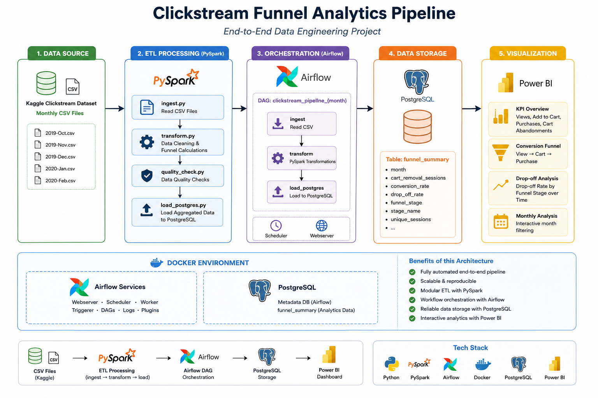
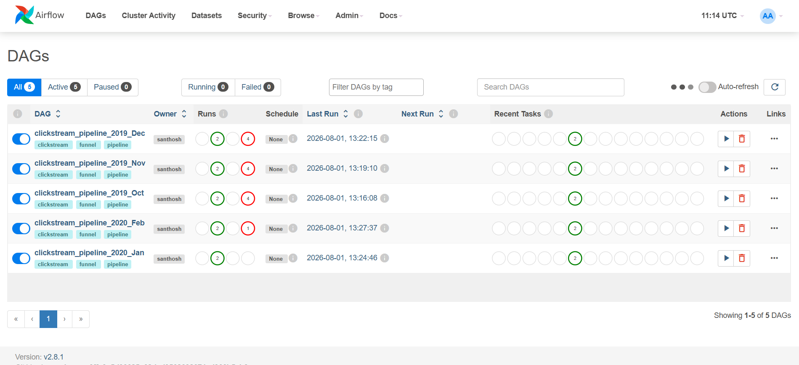
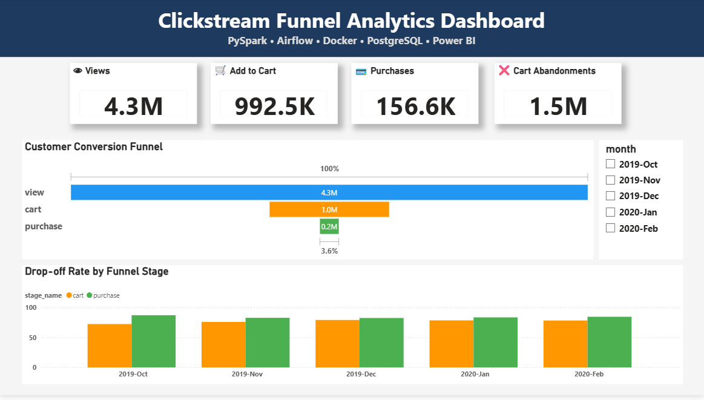

# Clickstream Funnel Analytics Pipeline


An end-to-end **Data Engineering pipeline** that processes large-scale e-commerce clickstream data using **PySpark**, automates ETL workflows with **Apache Airflow**, stores transformed analytics in **PostgreSQL**, and visualizes customer funnel insights through **Power BI**.

---

# Project Overview

This project demonstrates how raw clickstream data can be transformed into meaningful business insights through an automated data engineering pipeline.

The solution processes monthly customer clickstream events from a cosmetics e-commerce platform, performs data cleaning and transformation using PySpark, orchestrates ETL workflows with Apache Airflow, loads processed metrics into PostgreSQL, and delivers business insights through an interactive Power BI dashboard.

The project focuses on customer funnel analytics by calculating:

- Customer Conversion Funnel
- Cart Abandonment
- Monthly Drop-off Analysis
- Session-level Metrics
- Business KPIs

---

# Solution Architecture

<p align="center">

</p>

---

# Technology Stack

| Category | Technology |
|------------|------------|
| Programming | Python |
| Big Data Processing | PySpark |
| Workflow Orchestration | Apache Airflow |
| Containerization | Docker & Docker Compose |
| Database | PostgreSQL |
| Visualization | Power BI |
| Version Control | Git & GitHub |

---

# Dataset

This project uses the **eCommerce Events History in Cosmetics Shop** dataset from Kaggle.

**Dataset Source**

https://www.kaggle.com/datasets/mkechinov/ecommerce-events-history-in-cosmetics-shop

### Dataset Highlights

- Approximately **20 million clickstream events**
- Five monthly datasets
- October 2019 – February 2020
- Customer events:
  - View
  - Cart
  - Remove from Cart
  - Purchase

> **Note**
>
> The original dataset (~2.5 GB) is **not included** in this repository because it exceeds GitHub's file size limit.
>
> Download the dataset from Kaggle before executing the pipeline.

---

# Pipeline Workflow

```
                Kaggle Clickstream Dataset
                           │
                           ▼
                 PySpark Data Ingestion
                           │
                           ▼
                Data Cleaning & Validation
                           │
                           ▼
               Funnel Metric Calculation
                           │
                           ▼
               PostgreSQL Analytics Table
                           │
                           ▼
            Apache Airflow Workflow Scheduler
                           │
                           ▼
               Interactive Power BI Dashboard
```

---

# Features

- Automated ETL pipeline using Apache Airflow
- PySpark-based large-scale data processing
- Dockerized local development environment
- PostgreSQL analytics database
- Customer funnel analysis
- Cart abandonment tracking
- Monthly conversion analysis
- Interactive Power BI dashboard
- Modular ETL architecture
- Business KPI reporting

---

# Project Structure

```
clickstream-funnel-analytics-pipeline
│
├── airflow/
│   ├── dags/
│   │   └── clickstream_pipeline_dag.py
│   ├── logs/
│   ├── plugins/
│   ├── docker-compose.yaml
│   ├── Dockerfile
│   └── requirements.txt
│
├── screenshots/
│   ├── architecture.png
│   ├── airflow_dag.png
│   └── dashboard.png
│
├── ingest.py
├── transform.py
├── quality_check.py
├── load_postgres.py
├── Clickstream_Funnel_Analytics.pbix
├── README.md
├── .gitignore
└── LICENSE
```

---

# ETL Pipeline

## 1. Data Ingestion

- Reads monthly clickstream CSV files
- Loads datasets into PySpark DataFrames
- Automatically infers schema

---

## 2. Data Cleaning

- Removes invalid records
- Filters relevant customer events
- Validates session information
- Standardizes funnel stages

---

## 3. Data Transformation

Calculates:

- Unique Sessions
- Funnel Stages
- Previous Stage Sessions
- Drop-off Rate
- Cart Removal Sessions
- Monthly Funnel Metrics

---

## 4. Data Loading

The transformed analytics are loaded into PostgreSQL where they serve as the reporting layer for Power BI.

---

# Airflow DAG

Apache Airflow orchestrates the complete ETL workflow.

<p align="center">

</p>

### Pipeline Tasks

1. Ingest Data
2. Transform Data
3. Load into PostgreSQL

---

# Dashboard

<p align="center">

</p>

---

# Dashboard KPIs

- Total View Sessions
- Total Cart Sessions
- Total Purchase Sessions
- Cart Abandonments

Visualizations include:

- Customer Conversion Funnel
- Monthly Drop-off Rate Analysis
- Interactive Month Filter

---

# Key Business Insights

## High Customer Drop-off

A significant percentage of users leave between the **View** and **Cart** stages, indicating opportunities to improve product engagement and conversion.

---

## Cart Abandonment

A large number of customers remove products from their carts before purchasing, highlighting friction in the purchase journey.

---

## Monthly Funnel Performance

Tracking funnel metrics across multiple months enables comparison of customer behavior, purchasing trends, and marketing effectiveness.

---

# Challenges Solved

- Built an end-to-end data engineering pipeline integrating PySpark, Airflow, PostgreSQL, Docker, and Power BI.
- Automated monthly clickstream processing using Apache Airflow DAGs.
- Redesigned the funnel logic by treating `remove_from_cart` as a separate abandonment metric rather than a funnel stage.
- Calculated reusable business KPIs including conversion rate, drop-off rate, and cart abandonment.
- Designed a modular ETL architecture separating ingestion, transformation, validation, and loading.

---

# Data Quality Findings

| Column | NULL % | Decision |
|---|---:|---|
| `category_code` | 98.36% | Dropped entirely due to excessive missing values |
| `brand` | 40.45% | Retained since over half the records contained valid values |
| `user_session` | 0.02% (637 rows) | Rows dropped because session identifier is required for funnel analysis |

### Key Observation

`category_code` contained **98.36% NULL values**, indicating that the dataset primarily stores category information using `category_id` instead of the human-readable category code.

---

# Technical Decisions & Trade-offs

| Decision | Why | Trade-off |
|---|---|---|
| PySpark Local Mode | Suitable for ~500 MB monthly datasets and local development | Does not demonstrate distributed Spark cluster execution |
| One Airflow DAG per monthly file | Easier monitoring and failure isolation | More DAG definitions to manage |
| PostgreSQL as analytics layer | Native Power BI connector and fast reporting | Not optimized for petabyte-scale analytics |
| `remove_from_cart` tracked separately | Represents abandonment rather than forward funnel progression | Required redesigning the funnel calculation logic |
| Dockerized Airflow | Consistent development environment | Limited by local hardware resources |
| `host.docker.internal` database connection | Allows Docker containers to access PostgreSQL running on host | Platform-specific networking configuration |

---

# Honest Constraints

- Spark processing runs in **Local Mode** instead of a distributed cluster.
- The pipeline was developed and tested on a local machine using Docker.
- The original Kaggle dataset (~2.5 GB) is excluded from the repository because of GitHub file size limitations.
- PostgreSQL credentials must be configured locally before executing the project.
- A production deployment would store data in cloud storage (Amazon S3, Azure Data Lake, or Google Cloud Storage) and use a distributed Spark cluster.

---

# Prerequisites

Before running the project, ensure you have installed:

- Docker Desktop
- Python 3.10+
- PostgreSQL
- Power BI Desktop
- Kaggle Account (for downloading the dataset)

---

# How to Run

## Clone Repository

```bash
git clone https://github.com/santhoshreddykallam/clickstream-funnel-analytics-pipeline.git
```

---

## Build Docker Containers

```bash
docker compose up --build
```

---

## Access Airflow

```
http://localhost:8080
```

Default Credentials

```
Username : admin
Password : admin
```

---

## Trigger Pipeline

Run the Airflow DAG.

The pipeline automatically:

- Reads monthly clickstream CSV files
- Cleans and transforms data using PySpark
- Loads analytics into PostgreSQL

---

## Open Dashboard

Open

```
Clickstream_Funnel_Analytics.pbix
```

using Power BI Desktop.

---

# Future Improvements

- Deploy Spark on Kubernetes
- Store raw data in Amazon S3 or Azure Data Lake
- Replace PostgreSQL with Snowflake or BigQuery
- Add Great Expectations for automated data validation
- Implement CI/CD using GitHub Actions
- Add Apache Kafka for real-time streaming ingestion
- Parameterize Airflow DAGs for dynamic monthly execution

---

# Author

**Santhosh Reddy Kallam**

GitHub

https://github.com/santhoshreddykallam

LinkedIn

https://www.linkedin.com/in/santhosh-reddy-kallam/

---

# License

This project is licensed under the **MIT License**.

---

# If you found this project useful

⭐ Star this repository if you found it helpful!
